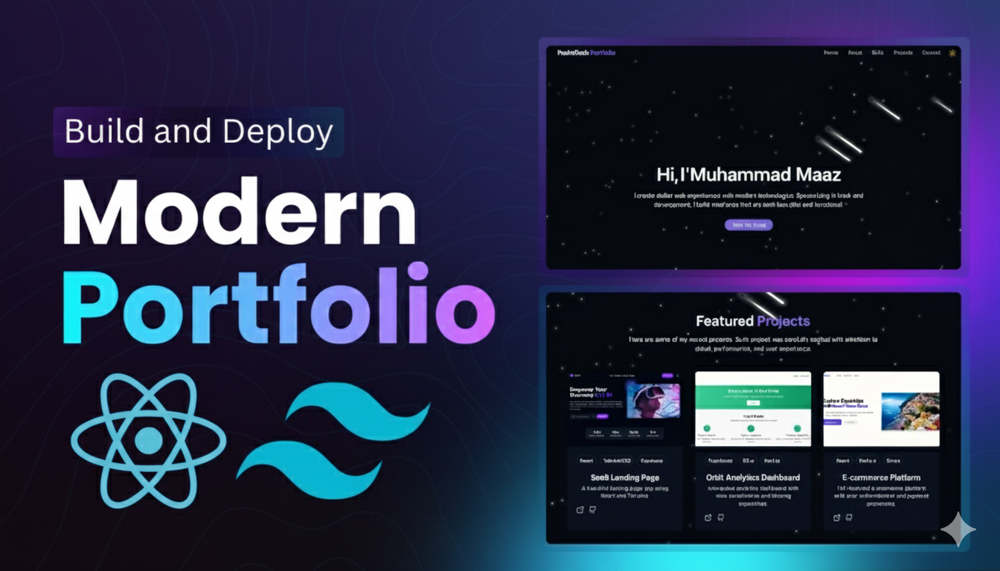

# M.Maaz-Portfolio
My personal portfolio showcasing projects, skills, and experience. Built with **React**, **TailwindCSS**, and deployed on **Netlify**.

<div align="center">
  
</div>

---

## 📋 Table of Contents
1. [Introduction](#introduction)
2. [Tech Stack](#tech-stack)
3. [Features](#features)
4. [Quick Start](#quick-start)
5. [Screenshots](#screenshots)
6. [Deployment](#deployment)
7. [Connect With Me](#connect-with-me)

---

## 🚀 Introduction
Welcome! This portfolio demonstrates my **frontend development skills** through live projects, animations, dark mode support, and responsive design. It’s built with modern tools to showcase my work in the best way possible.  

---

## ⚙️ Tech Stack
<div>
  
  
  
  
  
</div>

- **React** – Component-based UI  
- **TailwindCSS** – Modern utility-first CSS  
- **Vite** – Fast build tool  
- **Lucide Icons** – Beautiful icon pack  
- **Radix UI** – Accessible UI components  
- **Netlify** – Hosting & Deployment  

---

## ⚡️ Features
- 🌑 **Dark/Light Mode Toggle** with saved theme preference  
- 💫 **Animated Backgrounds** with stars, meteors, and glowing effects  
- 📱 **Responsive Navigation** for mobile and desktop  
- 👨‍💻 **Hero & About Sections** with smooth intro animations  
- 📊 **Skills Grid** with animated progress bars  
- 🖼️ **Projects Showcase** with images, GitHub/demo links  
- 📩 **Contact Section** with social icons & responsive form  

---

## 👌 Quick Start
### Prerequisites
- [Node.js](https://nodejs.org/)  
- [Git](https://git-scm.com/)  

### Clone & Run
```bash
git clone https://github.com/yourusername/M.Maaz-Portfolio.git
cd M.Maaz-Portfolio
npm install
npm run dev
